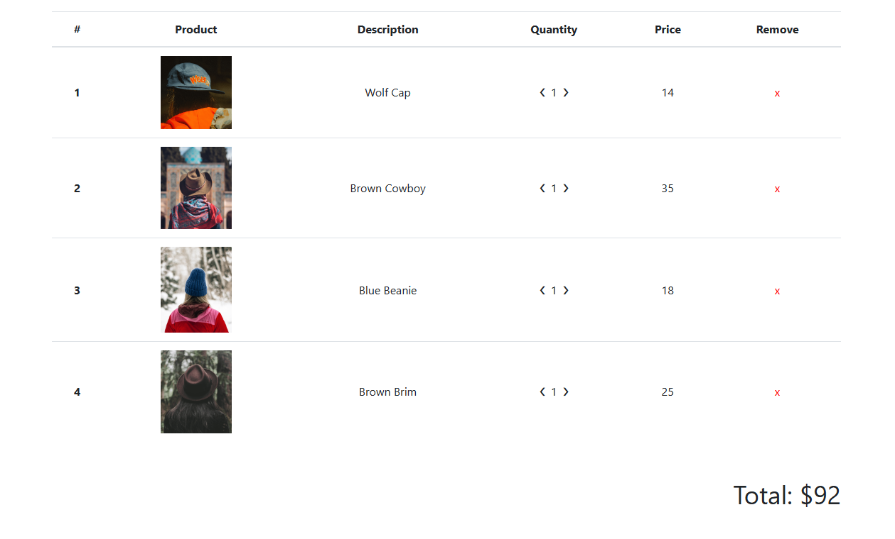
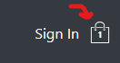

# [Working In Progress] Clothing Store Project

(Table Of Content) => Later On.

This is my first React project that utilizes TypeScript.
This documentation serves boths as a **reference** and **journal** for both future me and anyone interested in my project. Anyway! This is a quite long `README.md` so please bear with me!

So, Dear future self,

May this journal be of great assistance to you.

# Project Goals

- Create an ecommerce site that has navigation + routing which:
  - Takes us do different pages of categories of item
  - From these items, we're able to add them to our cart
  - We can see the direct update items in our cart
- The Cart funtionality:
  - We're about to check out
  - Increase or decrease these items
  - Instant updated reflected in our app
- Integrate with a Stripe API (test version only)
- Integrate with Firebase to handle Auth and the storage:
  - Sign in and sign up feature

# Project Solutions

- FrontEnd: React With TypeScript!
  - Build Tool: ViteJS⚡
- BackEnd:
  - Firebase
  - Firestore Database
  - Google Auth

# Development

- `npm install`
- Set up `firebaseConfig` file in the : `./src/services/firebase/firebase.config.ts`. Replace it with your own firebase configuration.
- `npm start`

And here are my several approach during the development process.

## Branching Names

- Feature branches: If you're creating a branch to work on a specific feature or user story, you can prefix the branch name with "feature/"/ For example:
  - 📝 `feature/user-registration`
  - 📝 `feature/payment-integration`
- Bug fix branches: If you're fixing a bug or addressing an issue, you can prefix the branch name with "bug/". For example:
  - 📝 `bug/login-redirect-issue`
  - 📝 `bug/database-connection-error`
- Hotfix branches: Hotfix branches are used to quickly address critical issues in production. You can prefix the branch name with "hotfix/". For example:
  - 📝 `hotfix/security-vulnerability`
  - 📝 `hotfix/critical-data-loss`
- Refactor branches: If you're refactoring or improving code without adding new features or fixing bugs, you can prefix the branch name with "refactor/". For example:
  - 📝 `refactor/database-schema`
  - 📝 `refactor/cleanup-css-styles`

## Naming

- File Name:
  - For react component, start with the Capital, and then use `.component`.
    For example: `CategoryItem.component.tsx`
  - For styling, start with the Capital, and then use `.styles`.
    For example: `CategoryItem.styles.scss`
  - For TS types. Use `.types`. For example : `datbase.types.ts`
  - Service:
    - firebase: For `auth`, please use this: `firebase.auth.ts`.
      For configuration: `firebase.config.ts`.  
      For db operation: use `.db.ts` for example `users.db.ts`
    - utils: any utils file will have `.utils` for example: `time.utils.ts`
  - Test: for test files, please use `xx.test.tsx`, and start it with Capital Letter. For example: `Categories.test.tsx`
  - For others: camelCase:
- Function Name:
  - Component Function: Start with a capital letter and use camelCase for subsequent words.
    For example: `CategoryItem`
  - Normal functions & variables: camelCase
    For example: `defaultValue`
  - Classes: Start with a capital letter and use camelCase for subsequent words. For example: `JoiValidator`

## Styling Configuration

- Using [saas](https://www.npmjs.com/package/sass)
- Here's the set up in the vite.config.ts: (Don't forget to create the file in the corresponding folder)

  ```
  import { defineConfig } from 'vite';
  import react from '@vitejs/plugin-react-swc';
  import {resolve} from 'path';

  // https://vitejs.dev/config/
  export default defineConfig({
    plugins: [react()],
    css: {
      preprocessorOptions: {
        scss: {
          additionalData: `@import "${resolve(__dirname, 'src/styles/variables.scss')}";`,
        },
      },
    },
  });
  ```

- Jest doesn't understand and handle SCSS files by default. To resolve this issue, you can mock the SCSS imports in your Jest test environment. And here's the config in the jest: (Don't forget to create the file in the corresponding folder)
  ```
  {
    "testEnvironment": "jsdom",
    "transform": {
      "^.+\\.tsx?$": "ts-jest"
    },
    "setupFilesAfterEnv": [
      "@testing-library/jest-dom/extend-expect"
    ],
    "moduleNameMapper": {
      "\\.(scss|css)$": "<rootDir>/style-mock.ts"
    }
  }
  ```

### Footer Setting

This would save future-me a lot. This is about Footer. Sometimes, the content is really short and the footer instead is at the bottom it would be in the middle like this:

I tried many things, and it didn't work to solve this issue. In many cases this won't happen since we put many items on the pages right. But let's solved it.

- First wrap all the HTML element / React Component outside the footer in a div so it's like this:

  ```
  export default function App() {
    return (
      <div>
        <div className='content'> //this one
          <Routes >
            <Route path='/' element={<Navigation navigationArray={navigationArray} />} >
              <Route index element={<Home />} />
              <Route path='shop' element={<Shop />} />
              <Route path='auth' element={<Authentication />} />
            </Route>
          </Routes>
        </div>

        <Footer />
      </div>
    );
  }
  ```

- Then give a clas name `content` or what ever you like.
- Okay then determined the height of the Footer. If you're not sure then you can check the console in the browser and count the height (click the element and count the height for the boddy - padding - border - margin) like this:
  
- Then put this css in the index/main css :

```
.content {
  min-height: calc(100vh - 80px);
}
```

- "Voila, it works!"

## Linting

The detail of the linting rules is this file `.eslintrc.cjs` :

- Indent tab: 2
- Semi colon: always
- Quotes: single
- Comma Dangle: always
- `indent: ['warn', 2, { SwitchCase: 1}]` . Don't forget for the SwitchCase

## Testing

I'm using several packages for this :

- `@testing-library/jest-dom": "^5.16.5`
- `@testing-library/react": "^14.0.0`
- `@types/jest": "^29.5.2"`
- `jest": "^29.5.0`
- `jest-environment-jsdom": "^29.5.0"`
- `ts-jest": "^29.1.1`

This is a good way to start the React TypeScript test:

- [Medium Article: Starting Jest](https://medium.com/tinyso/react-hero-typescript-jest-react-testing-library-setup-c2ecce18ec96)

Reading List:

- [Use Query](https://testing-library.com/docs/queries/about/)
- [Common Mistakes](https://kentcdodds.com/blog/common-mistakes-with-react-testing-library)

### Firebase Test

Here's the step:

- Install the CLI: [link](https://firebase.google.com/docs/cli#mac-linux-npm)
- Login: `firebase login` [Link](https://firebase.google.com/docs/cli#sign-in-test-cli)
- Set up the emulator : `firebase init emulators`. This set up everything and generate `firebase.json` like this :
  ```
  {
  "emulators": {
    "auth": {
      "port": 9099
    },
    "functions": {
      "port": 5001
    },
    "firestore": {
      "port": 8080
    },
    "database": {
      "port": 9000
    },
    "hosting": {
      "port": 5000
    },
    "pubsub": {
      "port": 8085
    },
    "storage": {
      "port": 9199
    },
    "eventarc": {
      "port": 9299
    },
    "ui": {
      "enabled": true
    },
    "singleProjectMode": true
    }
  }
  ```

Update: I'll skip this for a while.

### Handling SVG in Vite

- Install Dev Dependency: `vite-plugin-svgr`
- Then in the `vite.config.ts`

  ```
  import svgr from 'vite-plugin-svgr';

  export default defineConfig({
    plugins: [
      react(),
      svgr(),
    ],
    css: {
      preprocessorOptions: {
        scss: {
          additionalData: `@import "${resolve(__dirname, 'src/styles/variables.scss')}";`,
        },
      },
    },
  });

  ```

- Put this code on top of the file that you'd like to use it :
  `/// <reference types="vite-plugin-svgr/client" />`
  Read the information on NPM for more information about this.

### Handling SVG in Jest

Remember! SVG + Jest + TypeScript === `PAIN`
So, take a look this step to make your life easier.

- First of all, ensure that you follow the step above in **Handling SVG in Vite**
- Create a definition file : `svg.d.ts` and copy paste this
  ```
  declare module '*.svg' {
    // eslint-disable-next-line @typescript-eslint/no-explicit-any
    const content: any;
    // eslint-disable-next-line @typescript-eslint/no-explicit-any
    export const ReactComponent: any;
    export default content;
  }
  ```
- Then in the `jset.config.json` in the `moduleNameMapper`, add this :
  ```
  "\\.svg": "<rootDir>/src/__mocks__/svg-mock.ts"
  ```
- Create a file `svg-mock.ts` in the path above and copy paste this :
  ```
  const content = 'div';
  export const ReactComponent = content;
  export default content;
  ```
- This is the refernce from a blog : [Andre Biel Blog](https://medium.com/@real-biel/jest-typescript-and-svgs-44b4333a1164)

# The React App Overview

## Design Patterns

### Observer Pattern

Here's a little bit note about Observer pattern.
The Observer pattern is a design pattern that establishes a relationship between objects, where one object (called the subject or observable) maintains a list of other objects (called observers) and notifies them automatically of any state changes.

Here's a quick overview of how the Observer pattern works, including Next, Error, and Complete events:

- Subject: The subject is the main object that other objects are interested in observing. It maintains a list of observers and provides methods for adding, removing, and notifying observers.
- Observer: Observers are the objects that want to be notified of changes in the subject. They register themselves with the subject and provide an update mechanism to receive notifications.
- Registration: Observers register themselves with the subject by adding themselves to the subject's list of observers. This allows the subject to keep track of its observers.
- Notification: When the subject's state changes, it iterates through its list of observers and calls a specific method (often called update() or similar) on each observer. The subject may also pass relevant information or data to the observers during the notification.
- Updating: When an observer receives a notification, it performs the necessary actions based on the information received from the subject. The update mechanism can vary depending on the implementation and requirements of the observer.

In addition to the basic Observer pattern, there are three commonly used events in the context of observables:

- Next: The Next event represents a normal update or change in the subject's state. Observers receive this event and can take appropriate actions based on the new information.
- Error: The Error event is triggered when an exceptional or error condition occurs in the subject. Observers can handle this event to perform error handling, logging, or other necessary actions.
- Complete: The Complete event indicates the completion or termination of the subject's operation or task. Observers can use this event to finalize any pending activities or perform cleanup operations.

These events allow observers to respond to different situations and handle various scenarios effectively.

The Observer pattern, along with the Next, Error, and Complete events, promotes loose coupling between the subject and observers. It enables objects to establish a one-to-many relationship, where changes in one object are automatically propagated to multiple other objects. This ensures synchronization and maintains consistency between the subject and its observers, enhancing flexibility and extensibility in the system.

## React Routes

### [Home](./src/routes/home/Home.component.tsx)

**To-do item** Improve it

### [Navigation](./src/routes/navigation/Navigation.component.tsx)

**To-do item** Improve it

### [Authentication](./src/routes/authentication/Authentication.component.tsx)


### [Shop](./src/routes/shop/Shop.component.tsx)


### [Checkout](/src/routes/checkout/Checkout.component.tsx)



## Component

### [CategoryItem](./src/components/CategoryItem/CategoryItem.component.tsx)


### [Directory](./src//components/Directory/Directory.component.tsx)


### [SignIn](./src/components/SignIn/SignIn.component.tsx)


### [SignUp](./src/components/SignUp/SignUp.component.tsx)


### [Button](./src/components/Button/Button.component.tsx)


### [Footer](./src/components/Footer/Footer.component.tsx)


### [Loading](./src/components/Loading/Loading.component.tsx)

There are several loading components. All are in the same file


### [ProductCard](./src/components/ProductCard/ProductCard.component.tsx)


### [CartIcon](./src/components/CartIcon/CartIcon.component.tsx)



### [CartDropDown](/src/components/CartDropDown/CartDropDown.component.tsx)


### [CheckoutItem](./src/components/CheckoutItem/CheckoutItem.component.tsx)


## Styles

- [Google Fonts: Obitron](https://fonts.google.com/specimen/Orbitron)
- [styled-components](https://www.npmjs.com/package/styled-components)
  Using this package will help you a lot to avoid styling clash.
  Combine it with Bootstrap, and it'll look like this:

  ```
  import styled from 'styled-components';

  export const NavigationContainer = styled.nav.attrs({
    className: 'navbar navbar-expand-lg navbar-light bg-dark mb-3',
  })`
    <css properties here>
  `;
  ```

  Or sytling the existing component like this :

  ```
  export const LinkContainer = styled(Link)`
    <css properties here>
  `;
  ```

## Authentication

- Google Auth by Firebase Auth
- Email Auth by Firebase Auth
  To keep track of the User Authentication I used `onAuthStateChange`. So the Authentication is consistent.

## React Context

### User Context

Here's how to set up useContext for User in TypeScript:

```
import {
  createContext,
  useState,
  Dispatch,
  SetStateAction,
  ReactNode,
} from 'react';

import { User } from 'firebase/auth';

type UserContextType = {
  currentUser: User | null;
  setCurrentUser: Dispatch<SetStateAction<User | null>>;
}

type UserProviderProps = {
  children: ReactNode;
}

export const UserContext = createContext<UserContextType>({
  currentUser: null,
  setCurrentUser: () => null,
});

export function UserProvider({ children }: UserProviderProps) {
  const [currentUser, setCurrentUser] = useState<User | null>(null);
  const value = { currentUser, setCurrentUser };

  return (
    <UserContext.Provider value={value}>{children}</UserContext.Provider>
  );
}
```

### Product Context

All the product data is fetched from Firebasestore then stored in the `ProductContext`

### Cart Context

`CartContext` contains:

- `cart` : toogleOpen for the Cart Icon
  ```
  const defaultCartValue: CartType = {
    toogleOpen: false,
  };
  ```
- `cartItems`:
  ```
  export type CartItemsType = {
    id: number,
    category: string,
    quantity: number,
  }
  ```
- `countItems` : number
- `totalPrice`: number
- Functions:
  - `addCartItem`:
    ```
    addCartItem: (idProduct: number, category: string) => void
    ```
  - `subtractCartItem`
    ```
    subtractCartItem: (idProduct: number) => void
    ```
  - `removeCartItem`
    `      removeCartItem: (idProduct: number) => void
    `
    Maybe I 'll add more.

## Reducer

Internal React for state management is using `useContext` and withing the component, using `useState` or `useEffect` to access it.
The other strategy is using `useReducer`

So, instead of using `useState` to update the state, it has `Action` to update the state. Action has two things:

- type
- payload

Now let's start with the React `useReducer`. It's quite similar with `useState` but for complex state it's better to use `useReducer`. Now let's change our code to use `useReducer`, let's start with the simple one: state in the [`user.context.tsx`](./src/context/user.context.tsx);

first of all, like I mentioned before, let's comment out the `useState` in this code.
Let's set up the type first:

```
export enum USER_ACTION_TYPES {
  SET_CURRENT_USER = 'SET_CURRENT_USER',
}

type UserStateType = {
  currentUser: User | null;
}

type UserActionType = {
  type: USER_ACTION_TYPES;
  payload: User;
}
```

After that let's update the `UserContextType` the type of the `setCurrentUser`:

```
type UserContextType = {
  currentUser: User | null;
  setCurrentUser: (user: User) => void;
}
```

Great! Now let's move to the implementation:

```
function userReducer(state: UserStateType, action: UserActionType): UserStateType {
  console.log('dispatch');
  console.log(action);
  const { type, payload } = action;

  switch (type) {
    case USER_ACTION_TYPES.SET_CURRENT_USER:
      return {
        ...state,
        currentUser: payload,
      };

    default:
      throw new Error(`Unhandled type ${type} in userReducer`);
  }
}
```

Now let's set up the initial value for the state:

```
const INITIAL_STATE: UserStateType = {
  currentUser: null,
};
```

The function above takes two argument: the state (which we will define using `useReducer`),
and the second one is the action. The second one is an object that contains two properties:

- `type` which is a string. We defined it in an enum `USER_ACTION_TYPES`.
- `payload` which is a new state that we'd like to update it too.

Ok great now let's use it in the component:

```
  const [state, dispatch] = useReducer(userReducer, INITIAL_STATE);

  const { currentUser } = state;
```

First off all we define the state and the `dispatch` function using `useReducer` and also we pass the initial value for the state.
We can also do the destructuring for the state, in the case above I'm destructuring `{currentUser}` .

Next let's define the `setCurrentUser` functino like this :

```
  function setCurrentUser(user: User) {
    dispatch({
      type: USER_ACTION_TYPES.SET_CURRENT_USER,
      payload: user,
    });
  }
```

As you can see, the above function, we set the type using enum and then we set the payload to be the new user. And that's it. Now we already using `useReducer` instead of `useState`. The benefit of using `useReducer` instead of using `useState` is the flexibility to update the state, particularly if the state is quite complex.
One thing to remember is that if we'd like to update several multiple states, that it's best to use Reducer.

Here's the full code for it.

```
export function UserProvider({ children }: UserProviderProps) {
  // const [currentUser, setCurrentUser] = useState<User | null>(null);

  const [state, dispatch] = useReducer(userReducer, INITIAL_STATE);

  const { currentUser } = state;

  console.log(currentUser);

  function setCurrentUser(user: User) {
    dispatch({
      type: USER_ACTION_TYPES.SET_CURRENT_USER,
      payload: user,
    });
  }

  const value = {
    currentUser,
    setCurrentUser,
  };

  useEffect(() => {
    const unsubscribe = onAuthStateChangedListener(async (user) => {
      try {
        if (user) {
          const userExists = await userSnapshotExists(user);
          if (userExists) {
            setCurrentUser(user);
          }
        }
      } catch (err) {
        // eslint-disable-next-line no-console
        console.log(err);
      }
    });
    return unsubscribe;
  }, []);

  return (
    <UserContext.Provider value={value} >{children}</UserContext.Provider>
  );
}
```

and here's also the use of `useReducer` in the `cart.context`

```
import {
  createContext,
  ReactNode,
  useContext,
  useReducer,
} from 'react';

import { CategoriesContext } from './categories.context';

import { findProductItem } from './cart.helper';

export type CartType = {
  toogleOpen: boolean,
}

const defaultCartValue: CartType = {
  toogleOpen: false,
};

export type CartItemsType = {
  id: number,
  category: string,
  quantity: number,
}

type CartProviderProps = {
  children: ReactNode
}

type CartContextType = {
  cart: CartType,
  setCart: (bool: boolean) => void,
  cartItems: CartItemsType[],
  addCartItem: (idProduct: number, category: string) => void,
  subtractCartItem: (idProduct: number) => void,
  removeCartItem: (idProduct: number) => void,
  countItems: number,
  totalPrice: number,
}

export const CartContext = createContext<CartContextType>({
  cart: defaultCartValue,
  setCart: () => defaultCartValue,
  cartItems: [],
  addCartItem: () => {
    //default implementation
  },
  subtractCartItem: () => {
    //default implementation
  },
  removeCartItem: () => {
    //default implementation
  },
  countItems: 0,
  totalPrice: 0,
});

function generateAddCartItemArray(
  idProductToAdd: number,
  cartItems: CartItemsType[],
  category: string,
) {
  const index = cartItems.findIndex(item => item ? item.id === idProductToAdd : false);

  if (index === -1) {
    return [
      ...cartItems,
      {
        id: idProductToAdd,
        quantity: 1,
        category: category,
      },
    ];
  }

  const updatedCartItems = [...cartItems];
  updatedCartItems[index] = {
    ...updatedCartItems[index],
    quantity: updatedCartItems[index].quantity + 1,
  };

  return updatedCartItems;
}

function generateSubtractCartItemArray(
  idProductToSubtract: number,
  cartItems: CartItemsType[],
) {
  const index = cartItems.findIndex(item => item ? item.id === idProductToSubtract : false);

  if (index === -1 || cartItems[index].quantity <= 1) {
    return cartItems;
  }

  const updatedCartItems = [...cartItems];
  updatedCartItems[index] = {
    ...updatedCartItems[index],
    quantity: updatedCartItems[index].quantity - 1,
  };

  return updatedCartItems;
}

function generateRemoveCartItemArray(
  idProductToRemove: number,
  cartItems: CartItemsType[],
) {
  const updatedCartItems = cartItems.filter(item => item.id !== idProductToRemove);
  return updatedCartItems;
}

type CartStateType = {
  cart: CartType;
  cartItems: CartItemsType[];
  countItems: number;
  totalPrice: number;
}

type CartStateTypeWithoutCartToogle = Omit<CartStateType, 'cart'>

enum CART_ACTIONS_ENUM {
  SET_CART_ITEMS = 'SET_CART_ITEMS',
  SET_CART_TOOGLE = 'SET_CART_TOOGLE',
}

type CartActionTypeWithoutCartToogle = {
  type: CART_ACTIONS_ENUM;
  payload: CartStateTypeWithoutCartToogle,
}

type CartActionTypeWithCartToogleOnly = {
  type: CART_ACTIONS_ENUM,
  payload: boolean,
}

const INITIAL_CART_STATE: CartStateType = {
  cart: { toogleOpen: false },
  cartItems: [],
  countItems: 0,
  totalPrice: 0,
};

// eslint-disable-next-line @typescript-eslint/no-explicit-any
function isCartStateTypeWithoutCartToogle(variable: any): variable is CartStateTypeWithoutCartToogle {
  return variable.cart === undefined;
}

type CartActionType =
  | CartActionTypeWithoutCartToogle
  | CartActionTypeWithCartToogleOnly;

function cartReducer(
  state: CartStateType,
  action: CartActionType,
): CartStateType {
  const { type, payload } = action;

  switch (type) {
    case CART_ACTIONS_ENUM.SET_CART_ITEMS:
      if (!isCartStateTypeWithoutCartToogle(payload)) {
        throw new Error('payload is not of type CartStateTypeWithoutCartToogle');
      }
      return {
        ...state,
        ...payload,
      };

    case CART_ACTIONS_ENUM.SET_CART_TOOGLE:
      if (typeof payload !== 'boolean') {
        throw new Error('payload is not of type boolean');
      }
      return {
        ...state,
        cart: { toogleOpen: payload },
      };

    default:
      throw new Error(`unhandled type of ${type} in cart reducer. (hya)`);
  }
}

export function CartProvider({ children }: CartProviderProps) {
  const { categories } = useContext(CategoriesContext);

  const [state, dispatch] = useReducer(cartReducer, INITIAL_CART_STATE);

  const {
    cart,
    cartItems,
    countItems,
    totalPrice,
  } = state;


  function updateCartItemReducer(newCartItems: CartItemsType[]) {
    const newCountItems = generateNewCountItems(newCartItems);
    const newTotalPrice = generateNewTotalPrice(newCartItems);

    const payload: CartStateTypeWithoutCartToogle = {
      cartItems: newCartItems,
      countItems: newCountItems,
      totalPrice: newTotalPrice,
    };

    dispatch({
      type: CART_ACTIONS_ENUM.SET_CART_ITEMS,
      payload,
    });
  }

  function generateNewCountItems(newCartItems: CartItemsType[]) {
    return newCartItems.reduce((acc, curr) => acc + curr.quantity, 0);
  }

  function generateNewTotalPrice(newCartItems: CartItemsType[]) {
    return newCartItems.reduce((acc, curr) => {
      const productItem = findProductItem(categories, curr);
      if (!productItem) {
        return 0;
      }
      return acc + (curr.quantity * productItem.price);
    }, 0);
  }

  function setCart(bool: boolean) {
    dispatch({
      type: CART_ACTIONS_ENUM.SET_CART_TOOGLE,
      payload: bool,
    });
  }

  function addCartItem(idProduct: number, category: string) {
    const newCartItems = generateAddCartItemArray(idProduct, cartItems, category);
    updateCartItemReducer(newCartItems);
  }

  function subtractCartItem(idProduct: number) {
    const newCartItems = generateSubtractCartItemArray(idProduct, cartItems);
    updateCartItemReducer(newCartItems);
  }

  function removeCartItem(idProduct: number) {
    const newCartItems = generateRemoveCartItemArray(idProduct, cartItems);
    updateCartItemReducer(newCartItems);
  }

  const value = {
    cart,
    setCart,
    cartItems,
    addCartItem,
    subtractCartItem,
    removeCartItem,
    countItems,
    totalPrice,
  };

  return (
    <CartContext.Provider value={value}>{children}</CartContext.Provider>
  );
}
```

It's quite long isn't it? But let me put it here as a code snippet. Next we're going to use `Redux` as a library.

## Redux

In the documentation, it's commended to use both `React-Redux` and also `Redux Toolkit`.

Let's start to use `React-Redux only`. This is to understand how Redux works.

### Redux Vs Context API

There are only two differences:

- Accessibility
  Context: Only components that are wrapped withing the context can access it.
  Redux: Always wrapped in the entire application. All components have access to it. It's called global state management.

- Flow of Data
  Context: Component => |action| => Reducer => |values| => component
  Redux: Root Reducer => |pass State| => All Components ==> |one dispatch actions| => All Reducers. Singular store.

### Redux Set Up

- Dependencies
  ```bash
  npm i redux react-redux redux-logger
  ```

  ```bash
  npm i -D @types/redux-logger
  ```

  For most of the time we don't want to use Context and Redux at the same time. so let's change our previous implementation with Redux

- Store
  - Now let's create folder named `store`. 
  - Let's create several files: 
    - `store.ts` => store set up for Redux
    - `rootReducers.ts` => to combine all reducers 
    - Create a new folder named `user` then create a file `user.reducer.ts`
  - Great now let's go through it one by one: 
    `user.reducer.tx` => This is quite similar with the previous one that we create for context. The different is on default we return the current state, and also we passed in the initial state. 
    ```typescript
    /* eslint-disable @typescript-eslint/naming-convention */
    import { createContext } from 'react';

    import { User } from 'firebase/auth';

    type UserContextType = {
      currentUser: User | null;
      setCurrentUser: (user: User) => void;
    };

    export const UserContext = createContext<UserContextType>({
      currentUser: null,
      setCurrentUser: () => null,
    });

    export enum USER_ACTION_TYPES {
      SET_CURRENT_USER = 'SET_CURRENT_USER',
    }

    type UserStateType = {
      currentUser: User | null;
    };

    type UserActionType = {
      type: USER_ACTION_TYPES;
      payload: User;
    };

    const INITIAL_STATE: UserStateType = {
      currentUser: null,
    };

    export function userReducer(
      // eslint-disable-next-line @typescript-eslint/default-param-last
      state: UserStateType = INITIAL_STATE,
      action: UserActionType
    ): UserStateType {
      const { type, payload } = action;

      switch (type) {
        case USER_ACTION_TYPES.SET_CURRENT_USER:
          return {
            ...state,
            currentUser: payload,
          };

        default:
          return state;
      }
    }
    ```
    `rootReducer.ts`
    After we create the `user.reducer.ts`, it's time for us to combine it into the root reducer: 
    ```typescript
    import { combineReducers } from 'redux';
    import { userReducer } from './user/user.reducer';

    export const rootReducer = combineReducers({
      user: userReducer,
    });

    export default rootReducer;
    ```
    
    `store.ts`
    Here is our configuration for the store
    ```typescript
    import { compose, createStore, applyMiddleware } from 'redux';
    import logger from 'redux-logger';
    import { rootReducer } from './rootReducer';

    // root-reducer

    const middleWares = [logger];
    const composedEnhancers = compose(applyMiddleware(...middleWares));
    export const store = createStore(rootReducer, undefined, composedEnhancers);

    export default store;
    ```
  - Now let's wrap our application using Provider from `react-redux`:
  ```typescript
  import React from 'react';
  import ReactDOM from 'react-dom/client';
  import { BrowserRouter } from 'react-router-dom';
  import { Provider } from 'react-redux';

  import App from './App';
  import { UserProvider } from './context/user.context';
  import { CategoriesProvider } from './context/categories.context';
  import { CartProvider } from './context/cart.context';
  import { store } from './store/store';

  import './main.scss';

  ReactDOM.createRoot(document.getElementById('root') as HTMLElement).render(
    <React.StrictMode>
      <Provider store={store}>
        <BrowserRouter>
          <UserProvider>
            <CategoriesProvider>
              <CartProvider>
                <App />
              </CartProvider>
            </CategoriesProvider>
          </UserProvider>
        </BrowserRouter>
      </Provider>
    </React.StrictMode>
  );
  ```

- Use Redux state
Okay we already set it up, now it's time to implement it. 


# BackEnd

I'm using [Firebase](https://firebase.google.com/) here for the backend.

- `npm i firebase`. [Link](https://www.npmjs.com/package/firebase)

## Setting up Firestore Database

It consists of three things:

- data
- document
- collection

Example:

- '#' => collection
- '##' => document
- '###' => data

```
#Shoes#
  ##Shoe1##
    ###
    name: 'asdf'
    brand: 'asdf'
    imageURL: 'asdf'
    const:
      price: 200
      currencry: 'USD'
    ###
  ##Shoe1##
    ###
    name: 'asdf'
    brand: 'asdf'
    imageURL: 'asdf'
    const:
      price: 200
      currencry: 'USD'
    ###
```

Please take a look at the picture below:


## Database Structure

- Collection: `users`
  - document: `uid` || (how when email)
    - data:
      | Field | Type | Default Value (in Function) |
      |-----------------|-----------------|-----------------------------|
      | active | boolean | true |
      | createdAt | timeStamp | new Date() |
      | updatedAt | timeStamp | new Date() |
      | displayName | string | |
      | email | string | |
- Collection: `categories`

  - data: example: `hats`, `jackets`, `mens`, `sneakers`, `womens`
    | Field | Type | Default Value (in Function) |
    |-----------------|-----------------|-----------------------------|
    | title | string | example: `hats`, `jackets` |
    | items | {} | below |

    `item` object:
    | Field | Type | Default Value (in Function) |
    |-----------------|-----------------|-----------------------------|
    | id | number | |
    | imageUrl | string | |
    | name | string | |
    | price | string | |
    | stock | number | |

- Collection:
  - data
    | Field | Type | Default Value (in Function) |
    |-----------------|-----------------|-----------------------------|
    | | | |

# Journal

## Next ...

## July 7 2023

After spending a considerable amount of time on this project, I encountered a significant challenge while working with testing. Originally, my intention was to adopt the Test-Driven Development (TDD) approach for React. However, due to numerous errors, I made the decision to gradually introduce tests, one at a time. Additionally, I am currently in the process of familiarizing myself with Firebase and Firestore, which has proven to be a bit challenging when it comes to specifying the initial specifications.

Nevertheless, I firmly believe that practice is the key to mastery. In my future projects, I aspire to incorporate TDD into the development process of React applications, leveraging the lessons learned from this experience.
