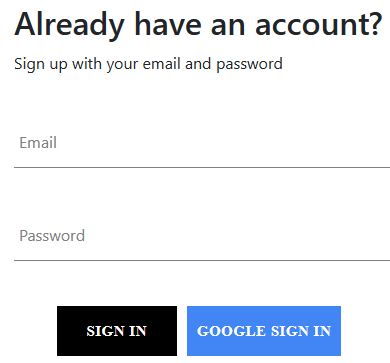

# [Working In Progress] Clothing Store Project

(Table Of Content) => Later On.

This is my first React project that utilizes TypeScript. 
This documentation serves boths as a **reference** and **journal** for both future me and anyone interested in my project. Anyway! This is a quite long `README.md` so please bear with me!

So, Dear future self, 

May this journal be of great assistance to you. 

# Project Goals

- Create an ecommerce site that has navigation + routing which: 
  - Takes us do different pages of categories of item
  - From these items, we're able to add them to our cart
  - We can see the direct update items in our cart
- The Cart funtionality: 
  - We're about to check out
  - Increase or decrease these items 
  - Instant updated reflected in our app 
- Integrate with a Stripe API (test version only)
- Integrate with Firebase to handle Auth and the storage: 
  - Sign in and sign up feature

# Project Solutions

- FrontEnd: React With TypeScript! 
  - Build Tool: ViteJS⚡
- BackEnd: 
  - Firebase
  - Firestore Database
  - Google Auth


# Development
- `npm install`
- Set up `firebaseConfig` file in the : `./src/services/firebase/firebase.config.ts`. Replace it with your own firebase configuration.
- `npm start`

And here are my several approach during the development process.

## Branching Names

- Feature branches: If you're creating a branch to work on a specific feature or user story, you can prefix the branch name with "feature/"/ For example: 
  - 📝 `feature/user-registration`
  - 📝 `feature/payment-integration`
- Bug fix branches: If you're fixing a bug or addressing an issue, you can prefix the branch name with "bug/". For example:
  - 📝 `bug/login-redirect-issue`
  - 📝 `bug/database-connection-error`
- Hotfix branches: Hotfix branches are used to quickly address critical issues in production. You can prefix the branch name with "hotfix/". For example:
  - 📝 `hotfix/security-vulnerability`
  - 📝 `hotfix/critical-data-loss`
- Refactor branches: If you're refactoring or improving code without adding new features or fixing bugs, you can prefix the branch name with "refactor/". For example:
  - 📝 `refactor/database-schema`
  - 📝 `refactor/cleanup-css-styles`

## Naming
- File Name: 
  - For react component, start with the Capital, and then use `.component`.
    For example: `CategoryItem.component.tsx` 
  - For styling, start with the Capital, and then use `.styles`.
    For example: `CategoryItem.styles.scss` 
  - For TS types. Use `.types`. For example : `datbase.types.ts`
  - Service:
    - firebase: For `auth`, please use this: `firebase.auth.ts`. 
      For configuration: `firebase.config.ts`.  
      For db operation: use `.db.ts` for example `users.db.ts`  
    - utils: any utils file will have `.utils` for example: `time.utils.ts` 
  - Test: for test files, please use `xx.test.tsx`, and start it with Capital Letter. For example: `Categories.test.tsx`
  - For others: camelCase:  
- Function Name:
  - Component Function: Start with a capital letter and use camelCase for subsequent words.
    For example: `CategoryItem`
  - Normal functions & variables: camelCase 
    For example: `defaultValue` 
  - Classes: Start with a capital letter and use camelCase for subsequent words. For example: `JoiValidator`

## Styling Configuration
- Using [saas](https://www.npmjs.com/package/sass)
- Here's the set up in the vite.config.ts: (Don't forget to create the file in the corresponding folder)
  ```
  import { defineConfig } from 'vite';
  import react from '@vitejs/plugin-react-swc';
  import {resolve} from 'path';

  // https://vitejs.dev/config/
  export default defineConfig({
    plugins: [react()],
    css: {
      preprocessorOptions: {
        scss: {
          additionalData: `@import "${resolve(__dirname, 'src/styles/variables.scss')}";`,
        },
      },
    },
  });
  ```
- Jest doesn't understand and handle SCSS files by default. To resolve this issue, you can mock the SCSS imports in your Jest test environment. And here's the config in the jest: (Don't forget to create the file in the corresponding folder)
  ```
  {
    "testEnvironment": "jsdom",
    "transform": {
      "^.+\\.tsx?$": "ts-jest"
    },
    "setupFilesAfterEnv": [
      "@testing-library/jest-dom/extend-expect"
    ],
    "moduleNameMapper": {
      "\\.(scss|css)$": "<rootDir>/style-mock.ts"
    }
  }
  ```
### Footer Setting
This would save future-me a lot. This is about Footer. Sometimes, the content is really short and the footer instead is at the bottom it would be in the middle like this: 

I tried many things, and it didn't work to solve this issue. In many cases this won't happen since we put many items on the pages right. But let's solved it. 
  - First wrap all the HTML element / React Component outside the footer in a div so it's like this:
    ```
    export default function App() {
      return (
        <div>
          <div className='content'> //this one
            <Routes >
              <Route path='/' element={<Navigation navigationArray={navigationArray} />} >
                <Route index element={<Home />} />
                <Route path='shop' element={<Shop />} />
                <Route path='auth' element={<Authentication />} />
              </Route>
            </Routes>
          </div>

          <Footer />
        </div>
      );
    }
    ```
  - Then give a clas name `content` or what ever you like. 
  - Okay then determined the height of the Footer. If you're not sure then you can check the console in the browser and count the height (click the element and count the height for the boddy - padding - border - margin) like this:
  
  - Then put this css in the index/main css : 
  ```
  .content {
    min-height: calc(100vh - 80px);
  }
  ```
  - "Voila, it works!"


## Linting

The detail of the linting rules is this file `.eslintrc.cjs` :
- Indent tab: 2 
- Semi colon: always
- Quotes: single
- Comma Dangle: always
- `indent: ['warn', 2, { SwitchCase: 1}]` . Don't forget for the SwitchCase

## Testing
I'm using several packages for this : 
- `@testing-library/jest-dom": "^5.16.5`
- `@testing-library/react": "^14.0.0`
- `@types/jest": "^29.5.2"` 
- `jest": "^29.5.0`
- `jest-environment-jsdom": "^29.5.0"`
- `ts-jest": "^29.1.1`

This is a good way to start the React TypeScript test: 
- [Medium Article: Starting Jest](https://medium.com/tinyso/react-hero-typescript-jest-react-testing-library-setup-c2ecce18ec96)

Reading List:
- [Use Query](https://testing-library.com/docs/queries/about/)
- [Common Mistakes](https://kentcdodds.com/blog/common-mistakes-with-react-testing-library)


# The React App Overview

## Design Patterns
### Observer Pattern 
Here's a little bit note about Observer pattern. 
The Observer pattern is a design pattern that establishes a relationship between objects, where one object (called the subject or observable) maintains a list of other objects (called observers) and notifies them automatically of any state changes.

Here's a quick overview of how the Observer pattern works, including Next, Error, and Complete events:

- Subject: The subject is the main object that other objects are interested in observing. It maintains a list of observers and provides methods for adding, removing, and notifying observers.
- Observer: Observers are the objects that want to be notified of changes in the subject. They register themselves with the subject and provide an update mechanism to receive notifications.
- Registration: Observers register themselves with the subject by adding themselves to the subject's list of observers. This allows the subject to keep track of its observers.
- Notification: When the subject's state changes, it iterates through its list of observers and calls a specific method (often called update() or similar) on each observer. The subject may also pass relevant information or data to the observers during the notification.
- Updating: When an observer receives a notification, it performs the necessary actions based on the information received from the subject. The update mechanism can vary depending on the implementation and requirements of the observer.

In addition to the basic Observer pattern, there are three commonly used events in the context of observables:

- Next: The Next event represents a normal update or change in the subject's state. Observers receive this event and can take appropriate actions based on the new information.
- Error: The Error event is triggered when an exceptional or error condition occurs in the subject. Observers can handle this event to perform error handling, logging, or other necessary actions.
- Complete: The Complete event indicates the completion or termination of the subject's operation or task. Observers can use this event to finalize any pending activities or perform cleanup operations.

These events allow observers to respond to different situations and handle various scenarios effectively.

The Observer pattern, along with the Next, Error, and Complete events, promotes loose coupling between the subject and observers. It enables objects to establish a one-to-many relationship, where changes in one object are automatically propagated to multiple other objects. This ensures synchronization and maintains consistency between the subject and its observers, enhancing flexibility and extensibility in the system.


## React Routes
### [Home](./src/routes/home/Home.component.tsx)
**To-do item** Improve it 
### [Navigation](./src/routes/navigation/Navigation.component.tsx)
**To-do item** Improve it 

## Component
### [CategoryItem](./src/components/CategoryItem/CategoryItem.component.tsx)

### [Directory](./src//components/Directory/Directory.component.tsx)

### [SignIn](./src/components/SignIn/SignIn.component.tsx)

### [SignUp](./src/components/SignUp/SignUp.component.tsx)

### [Button](./src/components/Button/Button.component.tsx)

### [Footer](./src/components/Footer/Footer.component.tsx)

### [Loading](./src/components/Loading/Loading.component.tsx)
There are several loading components. All are in the same file 


## Styles
- [Google Fonts: Obitron](https://fonts.google.com/specimen/Orbitron)


## Authentication
- Google Auth by Firebase Auth
- Email Auth by Firebase Auth
To keep track of the User Authentication I used `onAuthStateChange`. So the Authentication is consistent. 

## React Context
### User Context
Here's how to set up useContext for User in TypeScript: 
```
import {
  createContext,
  useState,
  Dispatch,
  SetStateAction,
  ReactNode,
} from 'react';

import { User } from 'firebase/auth';

type UserContextType = {
  currentUser: User | null;
  setCurrentUser: Dispatch<SetStateAction<User | null>>;
}

type UserProviderProps = {
  children: ReactNode;
}

export const UserContext = createContext<UserContextType>({
  currentUser: null,
  setCurrentUser: () => null,
});

export function UserProvider({ children }: UserProviderProps) {
  const [currentUser, setCurrentUser] = useState<User | null>(null);
  const value = { currentUser, setCurrentUser };

  return (
    <UserContext.Provider value={value}>{children}</UserContext.Provider>
  );
}
```


# BackEnd
I'm using [Firebase](https://firebase.google.com/) here for the backend.
- `npm i firebase`. [Link](https://www.npmjs.com/package/firebase)


## Setting up Firestore Database
It consists of three things:
- data
- document
- collection

Example:
- '#' => collection
- '##' => document
- '###' => data
```
#Shoes#
  ##Shoe1##
    ###
    name: 'asdf'
    brand: 'asdf'
    imageURL: 'asdf'
    const:
      price: 200
      currencry: 'USD'
    ###
  ##Shoe1##
    ###
    name: 'asdf'
    brand: 'asdf'
    imageURL: 'asdf'
    const:
      price: 200
      currencry: 'USD'
    ###
```
Please take a look at the picture below: 


## Database Structure 
- Collection: `users`
  - document: `uid` || (how when email)
    - data:
      | Field           | Type            | Default Value (in Function) |
      |-----------------|-----------------|-----------------------------|
      | active          | boolean         | true                        |
      | createdAt       | timeStamp       | new Date()                  |
      | updatedAt       | timeStamp       | new Date()                  |
      | displayName     | string          |                             |
      | email           | string          |                             |
- Collection: 
  - data 
      | Field           | Type            | Default Value (in Function) |
      |-----------------|-----------------|-----------------------------|
      |                 |                 |                             |
- Collection: 
  - data 
      | Field           | Type            | Default Value (in Function) |
      |-----------------|-----------------|-----------------------------|
      |                 |                 |                             |

# Journal
## Next ...
## July 7 2023
After spending a considerable amount of time on this project, I encountered a significant challenge while working with testing. Originally, my intention was to adopt the Test-Driven Development (TDD) approach for React. However, due to numerous errors, I made the decision to gradually introduce tests, one at a time. Additionally, I am currently in the process of familiarizing myself with Firebase and Firestore, which has proven to be a bit challenging when it comes to specifying the initial specifications.

Nevertheless, I firmly believe that practice is the key to mastery. In my future projects, I aspire to incorporate TDD into the development process of React applications, leveraging the lessons learned from this experience.